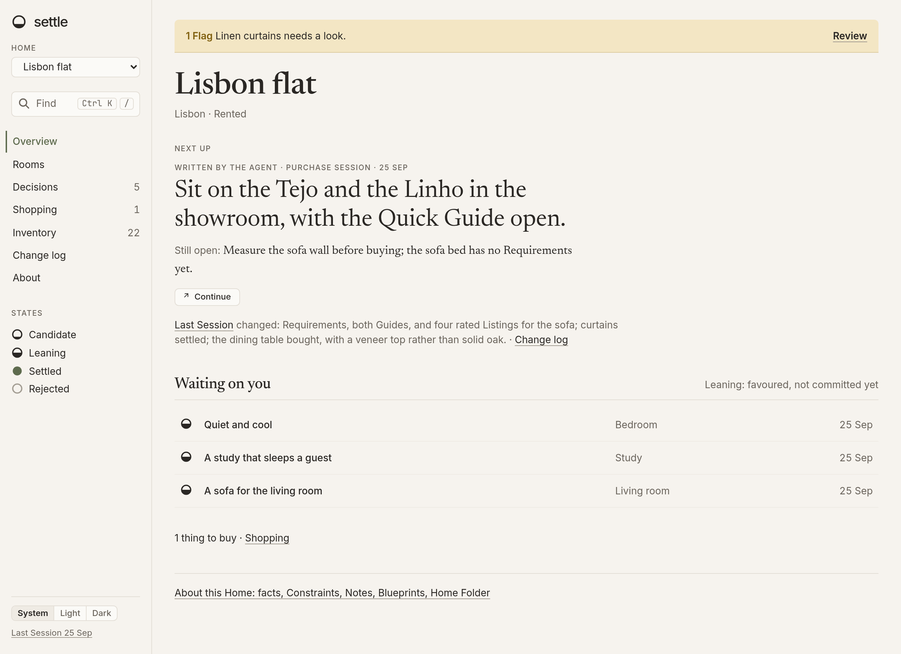
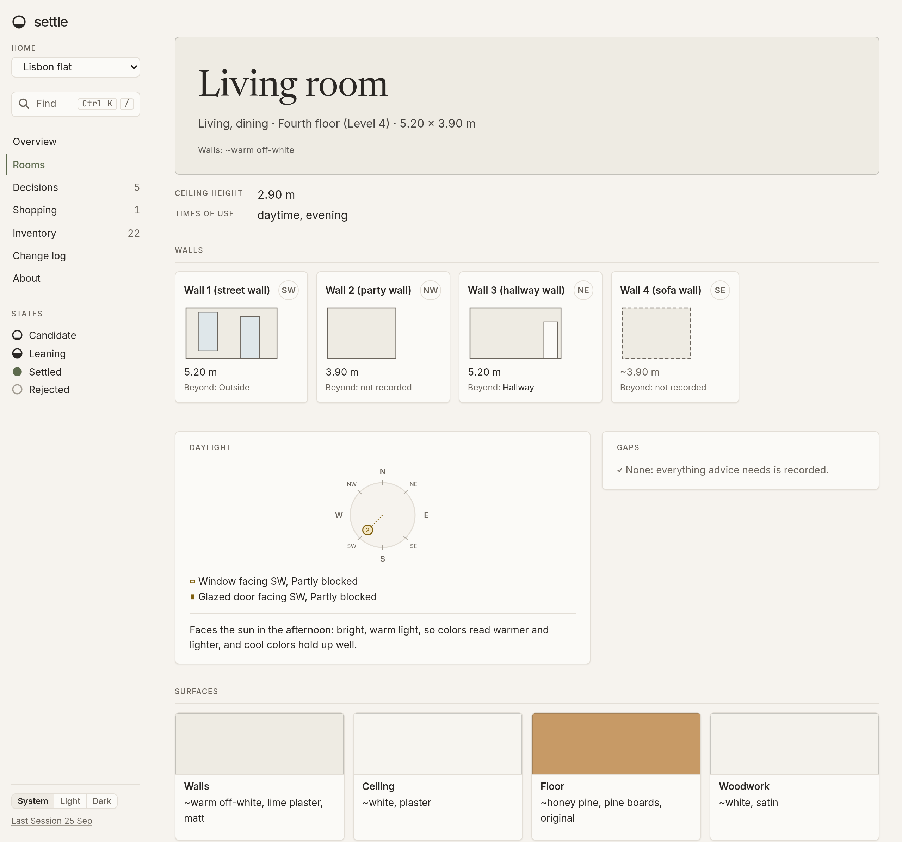
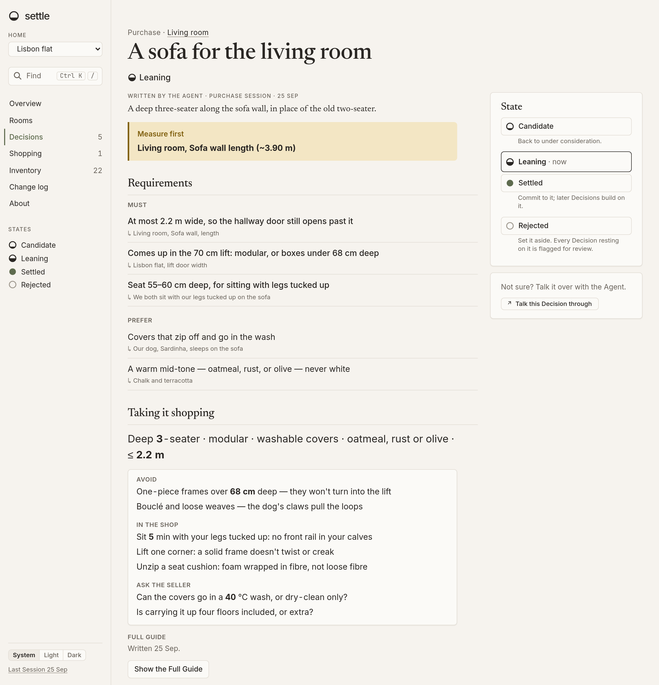

# Settle

Settle keeps a detailed record of your home — every room, how long each wall is and which way it
faces, where the windows and doors are, everything you own — and helps you decide how to furnish it
by talking it through with Claude. Each choice is a Decision you can settle, and later advice builds
on the ones you've settled. When you're buying something, it writes down what the thing has to fit
and why, then gives you a Quick Guide to take into the shop.

It runs as a small server on your own computer, with an MCP endpoint your own Claude session works
through.







## Install

Needs Node 26+, pnpm 12+ and [Claude Code](https://claude.com/claude-code).

```sh
pnpm install && pnpm build && pnpm start
```

The app opens at <http://127.0.0.1:4380>. Create a Home, then open its About page: it gives you the
command to set up a folder for that Home. In that folder, add the plugin and run `claude` there.

```sh
claude plugin marketplace add alexzfe/settle
claude plugin install settle@settle --scope project
```

To look around before entering your own home, create a Home called "Lisbon flat" and seed the demo
from the screenshots:

```sh
node scripts/seed-demo-home.mjs http://127.0.0.1:4380/mcp/homes/lisbon-flat
```

## No login

Settle has no authentication. It listens on `127.0.0.1` and that is the only thing protecting it:
anyone who can reach the server can read and change everything in it, including the rendered pages
of your floor plan. **Don't expose it to a network.** Authentication will ship before running Settle
on a server is supported.

## Notes

- Lengths are shown and entered in metres and centimetres only. Storage is millimetres, and Claude
  converts either way: tell it a wall is 12'6" and it records 3810 mm.
- The words used here and in the app — Home, Decision, Requirement, Quick Guide — are defined in
  [CONTEXT.md](CONTEXT.md).

## Licence

[AGPL-3.0-or-later](LICENSE). Bug reports and ideas are welcome as issues. Pull requests are not
accepted.
